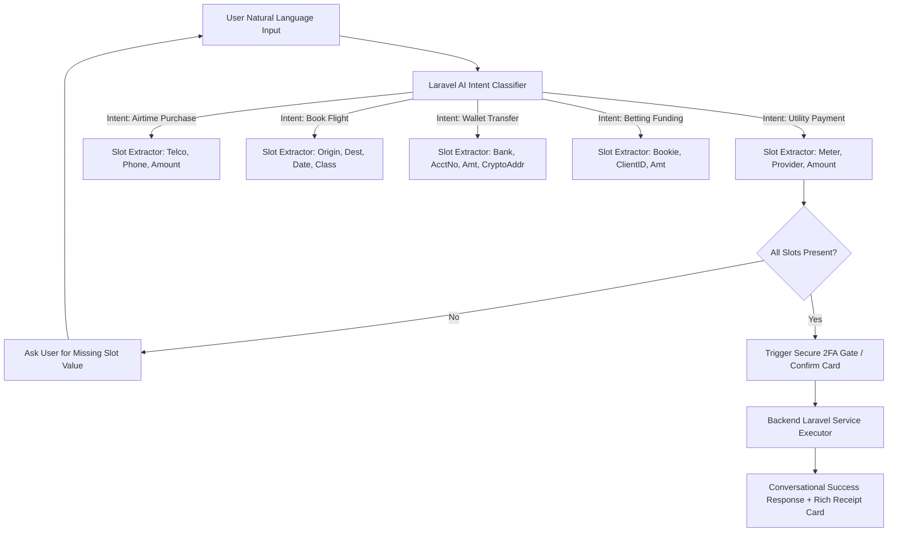

# PAXA AI Financial Assistant - Workflows & Interface Specs

**Version:** 1.0  
**Status:** Approved Specification  
**Primary Interface:** SalesCoach (Conversational AI Agent)

---

## 1. Conversational UI & Experience Design

Under the new PAXA paradigm, the **traditional visual user dashboard is entirely removed**. All interactions, transactions, and account management operations are performed through **SalesCoach**, a chat-first financial assistant. SalesCoach is accessible via:
1. **Premium Web Chat Interface** (Embedded in the PAXA web application).
2. **WhatsApp Business API** (Powered by Twilio).

### 1.1 Visual Design Guidelines (Web Chat)
To deliver a modern and premium experience, the web-based chat interface implements a **Glassmorphism Aesthetic** featuring high visual fidelity, smooth transitions, and tactile micro-animations.

```
┌────────────────────────────────────────────────────────┐
│  PAXA SalesCoach 🤖                                [—] │
├────────────────────────────────────────────────────────┤
│                                                        │
│  [Bot] Hello! I am SalesCoach, your AI financial       │
│  assistant. You can ask me to send money, buy          │
│  airtime, pay electricity bills, book flights,         │
│  deposit/withdraw crypto, or fund betting accounts!    │
│                                                        │
│  [Bot] Wallet Balance: ₦250,000 | $150.00 USDC         │
│                                                        │
│  [User] Send ₦5,000 to 0123456789 GTBank               │
│                                                        │
│  [Bot] ┌────────────────────────────────────────────┐  │
│        │ 📤 CONFIRM TRANSFER                       │  │
│        │ Recipient: Blessing Ade                    │  │
│        │ Bank: GTBank (0123456789)                 │  │
│        │ Amount: ₦5,000 | Fee: ₦10.00               │  │
│        │ [ Cancel ]       [ Confirm & Authorize ]  │  │
│        └────────────────────────────────────────────┘  │
│                                                        │
├────────────────────────────────────────────────────────┤
│  [🎙️] [Type a command or message...]             [📤] │
└────────────────────────────────────────────────────────┘
```

#### Styling Architecture
- **Backdrop Blur & Translucency:** Chat panels utilize a glassmorphic blur: `backdrop-filter: blur(20px) saturate(180%); background: rgba(255, 255, 255, 0.07)` on dark theme, and `rgba(27, 27, 24, 0.03)` on light theme.
- **Harmonious Palette:** Custom HSL colors. Accent colors use a glowing amber gradient (`hsl(38, 100%, 50%)` to `hsl(24, 100%, 50%)`) for interactive highlights, dark slate (`hsl(240, 10%, 10%)`) for primary chat backdrops, and soft mint (`hsl(150, 60%, 45%)`) for successful transaction indicators.
- **Micro-Animations & Transitions:**
  - *Typing Indicator:* Dynamic three-dot bouncing animation using bezier curves (`cubic-bezier(0.4, 0, 0.2, 1)`).
  - *Message Bubbles:* Smooth entrance with slide-in-up animation (`transform: translateY(10px); opacity: 0` transitioning to `translateY(0); opacity: 1` over 250ms).
  - *Glow Effects:* Interactive cards possess a active subtle neon drop-shadow: `box-shadow: 0 0 15px rgba(248, 184, 3, 0.15)`.

---

## 2. Intent Recognition & Slot Filling Engine

SalesCoach leverages an advanced intent-classification and entity-extraction pipeline (via Laravel AI and LLM tool bindings) to transform unstructured user speech into transactional actions.

### 2.1 Natural Language Processing (NLP) Flow


### 2.2 Extraction Templates (Slot Schema)

| Intent | Required Slots (Entities) | Examples & Validation |
| :--- | :--- | :--- |
| `send_funds` | `recipient_address`, `bank_code` (if fiat), `amount`, `currency` | "₦10,000", "0123456789 GTBank", "0x51c...USDT" |
| `withdraw_funds` | `destination`, `amount`, `currency` | "Withdraw ₦50,000 to my bank account" |
| `deposit_crypto` | `cryptocurrency` (`USDT` / `USDC`), `network` | "Deposit USDC", "Fund my wallet with USDT Tron" |
| `buy_electricity` | `meter_number`, `provider` (e.g. IKEDC, EKEDC), `amount` | "Meter 45091234567", "IKEDC", "₦15,000" |
| `buy_airtime` | `phone_number`, `telecom_operator` (MTN/Airtel/Glo), `amount` | "08031234567", "MTN", "₦2,000" |
| `fund_betting` | `betting_provider` (SportyBet, Bet9ja), `account_id`, `amount` | "SportyBet ID 8765432", "₦5,000" |
| `book_flight` | `departure_city`, `arrival_city`, `departure_date`, `passengers` | "Lagos to Abuja", "next Tuesday", "1 passenger" |

---

## 3. Transaction Conversational Scripts & Workflows

Below are the detailed, multi-turn conversational scripts representing the exact system responses, internal slot-filling actions, and interactive validation loops.

---

### 3.1 Cryptocurrency Deposit (USDT/USDC)
This flow allows users to fund their secure visual/virtual wallet using USDT or USDC.

```
User: I want to fund my wallet with crypto.
```
```json
// System Internal State
{
  "current_intent": "deposit_crypto",
  "slots": { "cryptocurrency": null, "network": null }
}
```
```
SalesCoach: 🪙 Great choice! I can generate a secure deposit address for you. 
Which cryptocurrency would you like to deposit: USDT or USDC?
```
```
User: USDT please.
```
```json
{
  "current_intent": "deposit_crypto",
  "slots": { "cryptocurrency": "USDT", "network": null }
}
```
```
SalesCoach: Excellent, USDT selected. Which network will you be using for this transaction? 
I support:
• Tron (TRC-20) - Fast & Low Fee [Recommended]
• Ethereum (ERC-20)
• Polygon
```
```
User: Tron network.
```
```json
{
  "current_intent": "deposit_crypto",
  "slots": { "cryptocurrency": "USDT", "network": "TRC-20" }
}
```
> [!IMPORTANT]
> When the required slots are satisfied, the system requests the crypto gateway service to spin up a dynamic, secure user wallet address.
```
SalesCoach: ⚡ Generating your TRC-20 USDT deposit address...

┌────────────────────────────────────────────────────────┐
│ 📥 USDT DEPOSIT DETAILS                                │
│                                                        │
│ Cryptocurrency: Tether (USDT)                          │
│ Network: Tron (TRC-20)                                 │
│                                                        │
│ Address: TX9uRk5pLqZ7M2VxYzKm5hQ3nJp1W9zAbC           │
│                                                        │
│ [📋 Copy Address]          [📱 Show QR Code]           │
└────────────────────────────────────────────────────────┘

⚠️ WARNING: Send only USDT to this address on the Tron (TRC-20) network. Depositing any other coin or using a different network will result in permanent loss of funds.

I am monitoring the blockchain for your transaction. I will notify you immediately once it is detected and confirmed (typically 1–2 minutes)!
```

---

### 3.2 Send & Withdraw/Remove Funds
Users can send P2P, initiate bank transfers (Naira payout), or withdraw their crypto assets.

#### Scenario A: Send Naira to a Local Bank Account
```
User: Send ₦15,000 to my cousin Ahmed Hassan.
```
```json
{
  "current_intent": "send_funds",
  "slots": { "recipient": "Ahmed Hassan", "amount": 15000, "currency": "NGN", "bank_name": null, "account_number": null }
}
```
```
SalesCoach: I've set up a transfer of ₦15,000 to Ahmed Hassan. 
To complete this, could you please provide Ahmed's bank name and account number?
```
```
User: Account number is 0112233445, GTBank.
```
```json
// System performs real-time bank resolution via API
{
  "current_intent": "send_funds",
  "slots": { "recipient": "Ahmed Hassan", "amount": 15000, "currency": "NGN", "bank_name": "GTBank", "account_number": "0112233445" },
  "resolved_name": "AHMED HASSAN BELLO"
}
```
```
SalesCoach: 🔍 Account resolved successfully!

┌────────────────────────────────────────────────────────┐
│ 📤 SEND FIAT FUNDS                                    │
│                                                        │
│ Recipient Name: AHMED HASSAN BELLO                     │
│ Destination: GTBank (0112233445)                       │
│ Send Amount: ₦15,000.00                                │
│ Transaction Fee: ₦10.00                                │
│ Total Debit: ₦15,010.00                                │
│                                                        │
│ [❌ Cancel]                   [🔒 Confirm & Pay]       │
└────────────────────────────────────────────────────────┘

Would you like to proceed with this transfer? If yes, please click "Confirm & Pay" or reply YES.
```
```
User: Yes.
```
```
SalesCoach: 🛡️ Security Check: To authorize this transfer of ₦15,000, please enter the 6-digit verification code sent to your registered mobile number / Google Authenticator.
```
```
User: 489201
```
```
SalesCoach: 🚀 Authorizing transaction...
Success! ₦15,010.00 has been debited from your virtual wallet. Ahmed Hassan Bello will receive the funds momentarily.

Transaction Reference: TXN-NGN-984021-AH
[📋 View Receipt]
```

#### Scenario B: Withdraw/Remove Crypto Funds
```
User: I want to withdraw $50 USDC to an external wallet.
```
```json
{
  "current_intent": "withdraw_funds",
  "slots": { "cryptocurrency": "USDC", "amount": 50, "network": null, "destination_address": null }
}
```
```
SalesCoach: Sure, let's process your $50 USDC withdrawal. 
Which network should we use (e.g. Ethereum, Polygon, Tron)?
```
```
User: Polygon network.
```
```
SalesCoach: Got it, Polygon network. Please provide the destination wallet address.
```
```
User: 0x71C7656EC7ab88b098defB751B7401B5f6d1476B
```
```json
{
  "current_intent": "withdraw_funds",
  "slots": { "cryptocurrency": "USDC", "amount": 50, "network": "Polygon", "destination_address": "0x71C7656EC7ab88b098defB751B7401B5f6d1476B" }
}
```
```
SalesCoach: 📊 Withdrawal Request Summary:

┌────────────────────────────────────────────────────────┐
│ 💸 WITHDRAW CRYPTO                                     │
│                                                        │
│ Currency: USD Coin (USDC)                              │
│ Network: Polygon                                       │
│ Destination: 0x71C7656EC7ab88...476B                   │
│ Amount: 50.00 USDC                                     │
│ Network Fee: 0.15 USDC                                 │
│ Total Debit: 50.15 USDC                                │
│                                                        │
│ [❌ Cancel]                  [🔒 Authorize Withdrawal]  │
└────────────────────────────────────────────────────────┘

Please click the button above or type "APPROVE" to process this blockchain withdrawal.
```
```
User: Approve
```
```
SalesCoach: 🛡️ Enter your 2FA security code to confirm:
```
```
User: 887201
```
```
SalesCoach: 🛰️ Broadcasting to Polygon network...
Withdrawal initiated! Your 50.00 USDC is on its way. You can track it on Polygonscan using the link below:

TX Hash: 0x74f8a...e901
[🔗 Track on Polygonscan]
```

---

### 3.3 Purchase Electricity Bill
Enables quick payments for utility meters via conversational prompts.

```
User: Pay my electricity bill.
```
```json
{
  "current_intent": "buy_electricity",
  "slots": { "provider": null, "meter_number": null, "amount": null }
}
```
```
SalesCoach: ⚡ I can help you purchase electricity instantly.
Which electricity distribution company (provider) is your meter registered with? (e.g., IKEDC, EKEDC, AEDC, IBEDC)
```
```
User: IKEDC (Ikeja Electric).
```
```
SalesCoach: IKEDC selected. Please enter your meter number.
```
```
User: Meter number is 45098234122
```
```json
// System performs real-time utility validation
{
  "current_intent": "buy_electricity",
  "slots": { "provider": "IKEDC", "meter_number": "45098234122", "amount": null },
  "resolved_customer": "Tunde Alabi (Address: 14, Bode Thomas St, Surulere)"
}
```
```
SalesCoach: 🔍 Verified! The meter belongs to **Tunde Alabi** at *14, Bode Thomas St, Surulere*.
How much electricity token would you like to buy (in Naira)?
```
```
User: ₦10,000
```
```json
{
  "current_intent": "buy_electricity",
  "slots": { "provider": "IKEDC", "meter_number": "45098234122", "amount": 10000 }
}
```
```
SalesCoach: 📑 Utility Payment Summary:

┌────────────────────────────────────────────────────────┐
│ ⚡ ELECTRICITY BILL PAYMENT                            │
│                                                        │
│ Provider: IKEDC (Ikeja Electric)                       │
│ Customer: Tunde Alabi                                  │
│ Meter Number: 45098234122                              │
│ Token Amount: ₦10,000.00                               │
│ Service Fee: ₦100.00                                   │
│ Total Cost: ₦10,100.00                                 │
│                                                        │
│ [❌ Cancel]                   [💳 Pay from Wallet]     │
└────────────────────────────────────────────────────────┘

Would you like to debit ₦10,100.00 from your virtual wallet to complete this purchase? (Reply YES or click the button)
```
```
User: Yes, go ahead.
```
```
SalesCoach: 🔌 Processing utility payment...
Success! Your payment was verified. Here is your electricity token:

🎫 TOKEN: **4582 - 9912 - 0482 - 1289 - 5821**
Value: 124.5 kWh
Receipt ID: REC-ELEC-90214

[📋 Copy Token] [📥 Download PDF Receipt]
```

---

### 3.4 Purchase Airtime
Instant mobile airtime top-ups via chat.

```
User: Buy airtime.
```
```json
{
  "current_intent": "buy_airtime",
  "slots": { "phone_number": null, "operator": null, "amount": null }
}
```
```
SalesCoach: 📱 Let's top up your phone! 
What phone number should I credit? (Or say "mine" to use your registered number)
```
```
User: Use mine.
```
```json
{
  "current_intent": "buy_airtime",
  "slots": { "phone_number": "+2348039821456", "operator": "MTN", "amount": null }
}
```
*(System automatically resolves user's registered phone number "+2348039821456" and detects the network operator as MTN).*
```
SalesCoach: Great, topping up your registered MTN number (+234 803 982 1456). 
How much airtime would you like to buy?
```
```
User: ₦1,500 please.
```
```json
{
  "current_intent": "buy_airtime",
  "slots": { "phone_number": "+2348039821456", "operator": "MTN", "amount": 1500 }
}
```
```
SalesCoach: 📱 Confirming your Airtime Top-up:

┌────────────────────────────────────────────────────────┐
│ 📞 AIRTIME PURCHASE                                    │
│                                                        │
│ Network Operator: MTN Nigeria                          │
│ Destination: +234 803 982 1456                         │
│ Top-up Value: ₦1,500.00                                │
│ Cost: ₦1,500.00 (Zero Fee)                             │
│                                                        │
│ [❌ Cancel]                   [⚡ Buy Now]             │
└────────────────────────────────────────────────────────┘

Ready to proceed? Click "Buy Now" or reply YES.
```
```
User: Yes!
```
```
SalesCoach: 💸 Debiting wallet and sending top-up request...
Success! ₦1,500.00 airtime has been sent to +234 803 982 1456. You will receive an SMS confirmation from MTN shortly.

Wallet Balance: ₦224,890.00
```

---

### 3.5 Fund Betting Account
Direct virtual-wallet-to-betting-platform account funding.

```
User: Put money in my betting account.
```
```json
{
  "current_intent": "fund_betting",
  "slots": { "betting_provider": null, "account_id": null, "amount": null }
}
```
```
SalesCoach: 🎰 Sure, I can fund your betting account instantly.
Which betting platform are you using? (e.g. SportyBet, Bet9ja, BetKing, 1xBet)
```
```
User: SportyBet.
```
```
SalesCoach: SportyBet selected. Please provide your SportyBet User ID or mobile number associated with the account.
```
```
User: ID is 8729381
```
```json
// System performs validation on SportyBet API
{
  "current_intent": "fund_betting",
  "slots": { "betting_provider": "SportyBet", "account_id": "8729381", "amount": null },
  "resolved_player": "Deji Olowo"
}
```
```
SalesCoach: 🔍 Account resolved! 
The SportyBet account belongs to **Deji Olowo**.
How much would you like to deposit?
```
```
User: Fund it with ₦5,000.
```
```json
{
  "current_intent": "fund_betting",
  "slots": { "betting_provider": "SportyBet", "account_id": "8729381", "amount": 5000 }
}
```
```
SalesCoach: 📑 Betting Funding Summary:

┌────────────────────────────────────────────────────────┐
│ 🎰 FUND BETTING ACCOUNT                                │
│                                                        │
│ Bookmaker: SportyBet                                   │
│ Player Name: Deji Olowo                                │
│ Account ID: 8729381                                    │
│ Deposit Amount: ₦5,000.00                              │
│ Transaction Fee: ₦25.00                                │
│ Total Debit: ₦5,025.00                                 │
│                                                        │
│ [❌ Cancel]                   [💸 Deposit Funds]       │
└────────────────────────────────────────────────────────┘

Would you like to complete this deposit? Click the button or reply YES to proceed.
```
```
User: Yes, send it.
```
```
SalesCoach: 🎰 Processing deposit...
Success! ₦5,000.00 has been credited to your SportyBet account (ID: 8729381). Your new SportyBet balance will reflect this instantly.

Transaction Reference: TXN-SPORTY-94819
```

---

### 3.6 Book Flights
Interactive flight booking, seat selection, and e-ticket generation via web chat or WhatsApp.

```
User: Book a flight for me.
```
```json
{
  "current_intent": "book_flight",
  "slots": { "departure_city": null, "arrival_city": null, "date": null, "passengers": 1 }
}
```
```
SalesCoach: ✈️ I can help you book domestic flights in seconds! 
Where are you flying from? (e.g. Lagos, Abuja, Port Harcourt)
```
```
User: I'm leaving from Lagos.
```
```
SalesCoach: Lagos (LOS) noted. What is your destination city?
```
```
User: Going to Abuja.
```
```
SalesCoach: Perfect, Lagos (LOS) ↔ Abuja (ABV). What date would you like to travel?
```
```
User: Next Tuesday, May 26th.
```
```json
{
  "current_intent": "book_flight",
  "slots": { "departure_city": "Lagos", "arrival_city": "Abuja", "date": "2026-05-26", "passengers": 1 }
}
```
```
SalesCoach: Great, searching for flights from Lagos (LOS) to Abuja (ABV) on Tuesday, May 26, 2026 for 1 passenger... 🔍

Here are the best available options:

✈️ OPTION 1: Air Peace (P4-7120)
• Departs: 08:30 AM | Arrives: 09:45 AM
• Duration: 1h 15m
• Price: ₦75,000.00

✈️ OPTION 2: Ibom Air (QI-504)
• Departs: 11:45 AM | Arrives: 01:00 PM
• Duration: 1h 15m
• Price: ₦82,000.00

✈️ OPTION 3: ValueJet (VK-204)
• Departs: 04:15 PM | Arrives: 05:30 PM
• Duration: 1h 15m
• Price: ₦68,000.00

Which option works best for you? Reply 1, 2, or 3.
```
```
User: Option 1, Air Peace looks good.
```
```json
{
  "current_intent": "book_flight",
  "slots": { "departure_city": "Lagos", "arrival_city": "Abuja", "date": "2026-05-26", "passengers": 1, "selected_option": 1 }
}
```
```
SalesCoach: Excellent choice! Air Peace departs at 08:30 AM. 
Now, please provide the full name of the passenger exactly as it appears on their government-issued ID.
```
```
User: Olumide Alabi
```
```
SalesCoach: What is the passenger's gender and date of birth? (Format: Gender, DD/MM/YYYY)
```
```
User: Male, 12/08/1992
```
```json
{
  "current_intent": "book_flight",
  "slots": {
    "departure_city": "Lagos", "arrival_city": "Abuja", "date": "2026-05-26", "passengers": 1, "selected_option": 1,
    "passenger_details": [
      { "name": "Olumide Alabi", "gender": "Male", "dob": "1992-08-12" }
    ]
  }
}
```
```
SalesCoach: Thank you, details saved. 
Would you like to select a seat preference? 
• Window Seat
• Aisle Seat
• No Preference (Free)
```
```
User: Window seat please.
```
```
SalesCoach: Seat preference noted. Window seat requested. 
Here is your booking summary:

┌────────────────────────────────────────────────────────┐
│ ✈️ FLIGHT BOOKING SUMMARY                              │
│                                                        │
│ Airline: Air Peace (P4-7120)                           │
│ Route: Lagos (LOS) → Abuja (ABV)                      │
│ Date: Tuesday, May 26, 2026                            │
│ Departure: 08:30 AM | Arrival: 09:45 AM                │
│ Passenger: Olumide Alabi (Male, Window Seat)           │
│                                                        │
│ Ticket Cost: ₦75,000.00                                │
│ Taxes & Fees: ₦5,000.00                                │
│ Total Price: ₦80,000.00                                │
│                                                        │
│ [❌ Cancel]                   [💳 Pay ₦80,000]         │
└────────────────────────────────────────────────────────┘

Would you like to debit ₦80,000.00 from your virtual wallet to confirm this ticket? Click the button or reply YES.
```
```
User: Yes, pay it.
```
```
SalesCoach: 💳 Debiting wallet and confirming reservation with Air Peace...
Success! Your flight is fully booked! 🎉

Booking Reference (PNR): **AP-LOSABV-77A91**
E-Ticket Number: **ETKT-0941829023**

I have generated your e-ticket as a secure PDF and attached it below:
[📥 Download Olumide_Alabi_Ticket.pdf]

Have a safe flight! ✈️ Let me know if you need to add baggage or travel insurance.
```

---

## 4. Error Recovery & Conversational Fallbacks
Under conversational systems, errors are inevitable. SalesCoach handles edge cases with elegant fallback prompts instead of crashing or repeating the same message.

### 4.1 Slot Validation Failures (e.g. Invalid Meter)
- **First Failure:** "Hmm, that meter number doesn't seem to exist on the IKEDC network. Could you double-check the digits on your meter box and reply with the correct number?"
- **Second Failure:** "I'm still having trouble verifying that meter number. Let's start this utility bill request again. What is your distribution company?"

### 4.2 Insufficient Balance
If the user tries to buy airtime, pay electricity, book a flight, send funds, or fund a betting account but their virtual wallet has insufficient funds:
- **Assistant Prompt:** "You're trying to make a payment of ₦10,000, but your current NGN wallet balance is ₦2,400. You can fund your wallet by depositing crypto (USDT/USDC) which we will instantly convert to Naira, or you can reduce the amount of your transaction. Would you like to view your crypto deposit address?"
